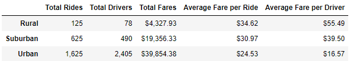
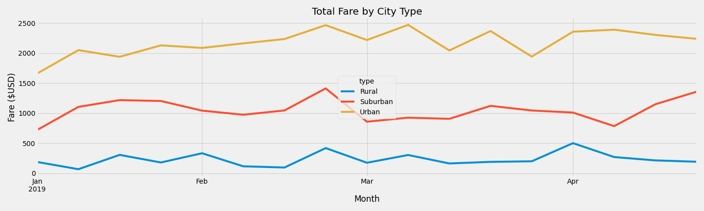

# PyBer_Analysis

Module 5

## Overview

This analysis was conducted as a supplement to the original PyBer Analysis which looked at fares, drivers and rides for Urban, Suburban and Rural areas.  This supplement presents a summary of the ride-sharing fare data with a final visualization that depicts the total weekly fares per city type from January to April, 2019.

## Results

The Urban city type had the most revenue overall at approximately $40, 000. Suburban was next with approximately $19,000 and lastly, Rural made just over $4,000.  Urban had the most rides and drivers which contributed to the large revenue seen for this type.  Suburban and Rural followed the same trends as before with rural bringing the least amount of rides and drivers.  The trends reversed when looking at the average fare per ride and average fare per driver.  Rural saw the highest numbers here and Urban was the lowest in these categories.  The chart below shows these results in more detail. 

## Summary

Looking at the data for January-April of 2019, in Rural settings there appears to be a spike at the beginning of each month, but in Urban and Suburban settings there is usually a dip at the beginning of the month.  This analysis could be continued for the remainer of the year to see if trends are identified.  If identified, then driver staffing could be adjusted based upon the projected need.  Based on the trends (if any), PyBer may wish to offer a coupon or special during those low weeks in an attempt to boost usage.   

Rural and Suburban fares were higher per ride and driver, which may be due to the longer distances between destinations in those areas vs the tighter geography of the Urban areas. Further analysis into the origin and destination of those categories may uncover useful information for staffing and may also identify a need for additional expansion into areas not currently covered by PyBer.  

Market research and comparison with other ride-sharing companies would give PyBer insight on where they stand within their market and could identify areas for improvement as well.  

